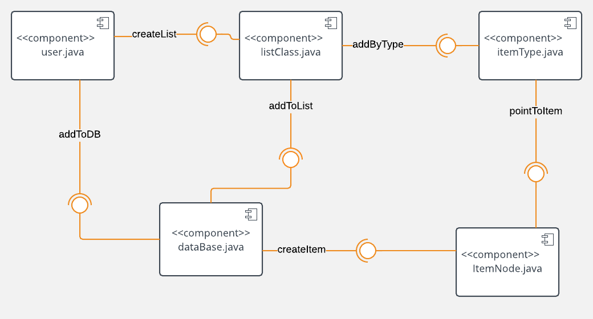

# Design Document

**Author**: Team 5

## 1 Design Considerations

### 1.1 Assumptions

The software GroceryListManager was sponsored by Brad and Janet; the purpose of this application is to allow users to develop their own grocery lists to utilize when shopping, replacing lists made with pen and paper. 

With regard to the software, we assume that there is enough space on the device carrying the application for it to be stored and run without issue. We also assume that each user of the application will have their own particular set of grocery lists; rather than having a log-in, the installation of the application will allow the user to have a space exclusive to the user for him or her to produce their own grocery lists. 

The software has no dependencies thus far, but must operate on environments that are at least API Level 21. 

### 1.2 Constraints

One of the requirements of provided states that the users must be able to add items to the database; though not exactly a constraint, it requires that the system's database be modifiable and up-to-date with what the user has specified. The application also asks that the user be able to have multiple lists at any time; therefore, the system must support the storage of multiple user lists. Developmentally, the system will be designed with Android Studio. 

### 1.3 System Environment

As stated above, the system must be able to operate on phones that are at least API Level 21, which corresponds to Android 5.0. An example device that runs Android 5.0 would be the Nexus 6, which features a resolution of 2560x1440 pixels and 3GM of RAM. 

## 2 Architectural Design

### 2.1 Component Diagram

#### Relationships between components
	- This diagram depicts the relationship between the components of the Grocery Manager List
	- The user component has access to the interface of the listClass component by having the ability to create lists
	- The user component also has access to the interface of the database component by means of adding items to the database when they do not exist.
	- The list class has access to the database so that it can add items to the list
	- The list class also has access to the itemType component so the user can browse for items by type
	- The itemType component has access to the itemNode component so it can offer the user items sorted by types
	- The database component has access to the itemNode component so it can create the items. 

### 2.2 Deployment Diagram

A diagram displaying where the components would be deployed is unreasonable because all of the components would live on the  app. This also would be beneficial for efficency and performance purposes. 

## 3 Low-Level Diagram

*Describe the low-level design for each of the system components identified in the previous section. For each component, you should provide the details in the following UML diagrams to show its internal structure.*

### 3.1 Class Diagram

## 4 User Interface Diagram
*For GUI-based systems, this section should provide the specific format/layout of the user interface of the system (e.g., in the form of graphical mockups).*
