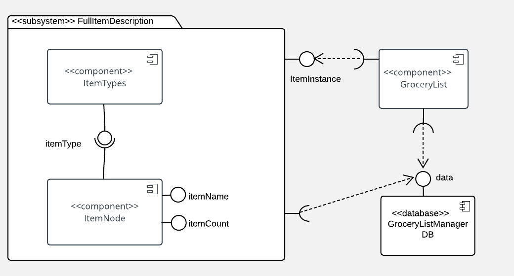

# Design Document

**Author**: Team 5

## 1 Design Considerations

### 1.1 Assumptions

The software GroceryListManager was sponsored by Brad and Janet; the purpose of this application is to allow users to develop their own grocery lists to utilize when shopping, replacing lists made with pen and paper. 

With regard to the software, we assume that there is enough space on the device carrying the application for it to be stored and run without issue. We also assume that each user of the application will have their own particular set of grocery lists; rather than having a log-in, the installation of the application will allow the user to have a space exclusive to the user for him or her to produce their own grocery lists. 

The software has no dependencies thus far, but must operate on environments that are at least API Level 21. The software utilizes the Room persistence library to facilitate the database. 

### 1.2 Constraints

One of the requirements of provided states that the users must be able to add items to the database; though not exactly a constraint, it requires that the system's database be modifiable and up-to-date with what the user has specified. The application also asks that the user be able to have multiple lists at any time; therefore, the system must support the storage of multiple user lists. Developmentally, the system will be designed with Android Studio. 

### 1.3 System Environment

As stated above, the system must be able to operate on phones that are at least API Level 21, which corresponds to Android 5.0. An example device that runs Android 5.0 would be the Nexus 6, which features a 2.7 GHz quad-core processor and 3GM of RAM. Picture-wise, the phone display is 5.96 inches; it has a resolution of 2560 x 1440 pixels. 

## 2 Architectural Design

### 2.1 Component Diagram

**Relationships between components**

The diagram above depicts the relationship between various components of the Grocery List Manager application. The ItemNode component relates to the ItemType component in that ItemType provide information about the item's type, through the variable itemType, to the item. The ItemNode component provides information about the item's name, and the item's quantity, through itemName and itemCount respectively. We group both ItemNode and ItemType together because combined they provide the full item description with regard to an instance of an item; this information is provided to the component GroceryList. All of these components must interact with the database; the database component provides information through the Room persistence library which in turn utilizes SQLite to return data such as the list's name, and currently stored item names and types. 

### 2.2 Deployment Diagram

A diagram displaying where the components would be deployed is unreasonable because all of the components would live on the  app. This also would be beneficial for efficency and performance purposes. 

## 3 Low-Level Diagram

### 3.1 Class Diagram

## 4 User Interface Diagram

  
 

[Video Link](https://drive.google.com/open?id=1Rt0HN0oYy50u2Q0CKvZqydzziEVmp4v-)
