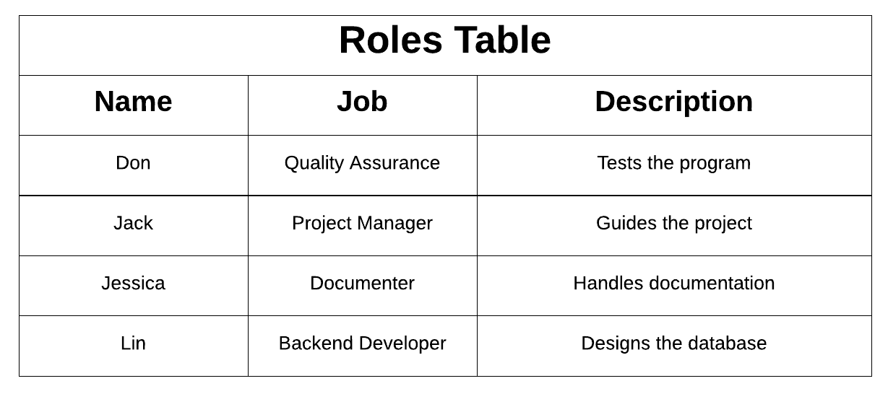

# Project Plan

**Author**: Jessica Don Jack Lin

## 1 Introduction

The product we are building is a grocery list manager; this application will be used to make grocery lists.

## 2 Process Description

- **create list**
	
	This activity would allow the user to create a blank list. The user can then modify this newly created list, updating it by adding and deleting items. 
	- As its input, the application would require a name for the list to be created. 
	- The output would be an empty, modifiable list. The process has been completed properly when a list appears on the main screen with the provided name; when selected, there should be no items on this list, and the list should provide options to modify it. 
	
	
- **delete list**

	This process lets the user remove a previously created list. The list, specifically its name and specific contents, are deleted from the database. 
	- The process would take as its input the name of the list to be deleted. 
	- There is no specific output for this process; the user knows this activity has completed when the deleted list is no longer available or accessible on the main screen, where stored lists can be selected. 
	
	
- **rename list**

	This process lets user change the name of a previously created list to one specified by the user. The updated name is stored in the database. 
	- This activity takes as an input the new name for the list. 
	- There is no specific output for this process, but we know the process has finished successfully when on the main screen we can see the renamed list; when that list is selected, its contents should be the same as the list before it was renamed.
	
	
- **select list**

	The process of selecting a list is required because it allows user to specify a specific list. One a list is selected, it can be modified. 
	- The process takes as its input the name of the list to be selected.
	- This activity has no specific output; however, we know that it has completed successfully when we are taken to a screen that displays the content of that list, as well as options to modify it. 

- **add to database**
	
	Add to database is a required process because it allows the user to add a new item to the database. The user can access this process if the item does not previously exist in the database. 
	- The process requires an item name and a corresponding item type for its input. 
	- There is no specific output for this process. Successful completion of this process results in the created item being a new option to add to a grocery list. 
	
	
- **search by query**

	This activity will allow the user to search for a specific item to add to a list. If the item is not found, the user is given the option to add a new item to the database. 
	- This activity takes as its input the string that the user attempts to search for. 
	- If the item is present, the process outputs an item name that is similar to, or exactly matches, the user's input. We know the process has completed successfully if the user is either given a similar or exact match to their search and can select the match to add the item to the list (because the item is present), or if they utilize the option to add an item to the database (because the item is not present). 

- **search by type**

	Specify by type allows the user to add items to a selected list by first indicating the type of item they are searching for, and then selecting the item they desired from that category.  
	- As input, the process takes first the item type, and then the item name for a specific item. 
	- With regard to output, there is nothing in particular. However, the process's success will result in an item being added to the selected list; the quantity of this item can then be updated.  
	
	
- **clear all checks**

	This process lets the user remove checkmarks from every item in a selected list. The user can still add checkmarks to each item afterwards. 
	- There is no specific input for this process. 
	- There is no specific output for this process; however, we know that the process has completed successfully when all checkmarks that were present prior to running the process are no longer present after running the process. 
	
	
- **check off specific**

	This process allows a user to add a checkmark to a specific item on a list. As an example, these checkmarks can be used to help a user specify if a particular item from a grocery list has been purchased. 
	- The input for this process is a specific item in a selected list. 
	- There is no specific output for this process. The user knows the activity has completed when a checkmark appears next to the item that the process is called upon. 
	
	
- **delete from list**

	This process allows the user to modify a specified list by removing an item from it. The deleted item can be added once more to the list if the user so desires. 
	- The input here is the name of item to be removed. 
	- There is no specific output for this process. Delete from list has been completed successfully when the item specified is no longer present on the list. 
	
	
- **update the quantity**

	This process facilitates the update of how much of a particular item the user would like to get. The updated quantity will be stored in the database. 
	 - The process takes as its input a numerical quantity. 
	 - There is no specific output for this process. The user can verify that the process has run successfully by checking to see that the updated quantity has been incorporated into the list next to the correct item.  

## Team 5

