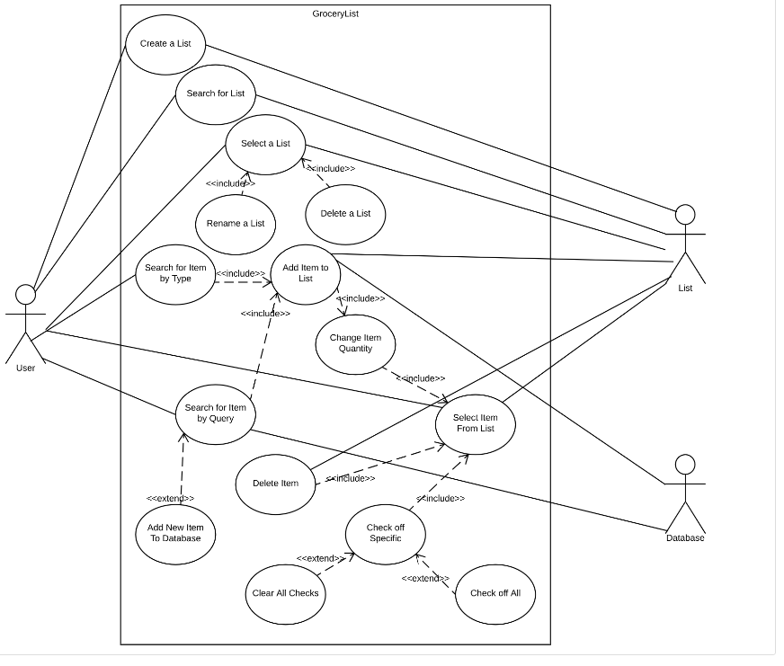

# Use Case Model 

**Author**: Jessica Thomas

## 1 Use Case Diagram

## 2 Use Case Descriptions

1. Create a List
    - The use case must allow the user to produce a new, blank list. The list must be modifiable  
and remembered as well. Upon creation, the list must be given a name. 
	- Before the use case is run, there must be enough space to store the produced list. 
	- Once the use case is run, the newly produced list must not have the same name as any  
currently stored list. 
	- If there is no space for the list to be stored, then the list should not be created  
until there is; this attempt at creation returns a message to the user clarifying this. If also,  
the user calls the method, but attempts to create a list with the same name as another, this  
method should also return a message telling the user he or she cannot do this, but allow the user  
to attempt to create a list again. Normally, the user should ask to create a list, and a blank,  
new list is created for the user to modify. 

2. Search for List
   - The user can optionally call on this function if he or she would like to search their  
created lists for a particular list by name. 
	- There must be at least one list present for the user to search. 
	- There are no particular post-conditions that must be true once the use case is run. 
	- Once the method is invoked, If the searched-for list exists, then the method should  
then confirm with the user that it does, and offer the user the option of selecting the list. If  
it does not exist, then the program should relay so to the user, and ask the user if he or she  
would like to create such a list. 

3. Select a List
	- The user can pick a list to modify with this use case. 
	- There must be at least one list in existence for the user to select before this use  
case is run. 
	- There are no particular post-conditions that must be true once the use case is run.
	- If the user invokes the option to select a list, the selected list must become the list  
that the user is currently modifying. In addition, the user should be allowed to not select a  
list and simply exit the called function. 

4. Rename a List 
	- The user must be able to create a new name for a currently existing list. 
	- Before the case is run, there must be at least one list in existence. In addition, the  
list to be modified must be the currently selected list. 
	- After the use case is run, the newly named list must not share a name with any list  
currently in existence. 
	- The user must select a list first in order to rename it. Once the user finishes input  
of the name, the application must check to see that the desired name does not match the name of a  
currently existing list. If it does, the application must inform the user and then offer the  
option of renaming again. If it does not match any existing list, the rename should be allowed to  
go through. 

5. Delete a List
	- The user must be able to delete a currently existing list. 
	- Before the case is run, there must be at least one list in existence. In addition, the  
list to be deleted must be the currently selected list. 
	- There are no particular post-conditions that must be true once the case is run. 
	- The user must first select a list. Then once the list is selected, the user must  
specify they would like to delete the list. The application must then confirm that this is the  
list to be deleted. Once the list is erased, the application should ask the user whether they  
would like to create, search, or select a list.

6. Search for Item by Type
	- The user must be able to specify the type of the item to then select the name of an  
item to add it to the list currently in modification. 
	- Before the use case is run, there must be at least one type and name associated with  
that name for the user to choose from. 
	- After the use case is run, it must first invoke the use case of "Add Item to List" and  
then subsequently the use case to change quantity, so that the added item can be adequately  
modified. 
	- After the user decides to run the method, they must be given a list of Types to choose  
from. Next, the user is given a list of names associated with the chosen type to select. They are  
then allowed to change the quantity from there. The application must again ask the user if they  
would like to add an item by type, but also give the option for the user to exit the method. 

7. Add Item to List
	- The specified item must be added to the currently modified list with this use case. 
	- There must be at least one item in the database for the user to modify. 
	- After the use case is run, the use case "Change Item Quantity" is invoked to  
immediately specify the number of this particular item. 
	- The user has specified the item, either by searching its name, or by specifying type  
and then name. The name and type of the specified item are recorded, and this information is  
placed onto the list, grouped together by type. 

8. Change Item Quantity 
	- This use case must allow the user to change the item quantity specified. 
	- There must be an item currently specified in order to invoke this use case. 
	- After the use case is run, the item specified must have its updated quantity recorded  
in memory. 
	- The item to be modified is specified. The currently quantity stored in record is  
updated to the newly specified quantity. The user then must select an item again to modify it. 

9. Search for Item by Query
	- This use case must allow the user to add an item to the list by searching for it in the  
database. 
	- There are no particular pre-conditions that must be true before the use case is run.  
	- After the use case is run, the database must have been updated to include new items, if  
the use case "Add New Item to Database" is run. 
	- The user first inputs a search query for the database to compare to. The database must  
attempt to match the query with any items currently in the database. Search results are returned,  
and the user is given the option to add the correct item, if it is present, to the list. If none  
of the returned results are correct, the user should be given the option to invoke the use case  
"Add New Item to Database". 

10. Select Item From List
	- After this use case is invoked, an item should be highlighted for modification in the  
list currently being modified. 
	- There must be at least one item on this list for the use case to be invoked. 
	- The item selected must be modifiable. 
	- When this use case is invoked, the user should be able to look through the list,  
eventually settling on an item to specify. When this item is specified, options should appear for  
its modification. 

11. Delete Item
	- This use case should allow the user to remove an item from a list currently being  
modified. 
	- There must be an item present on the list in order for this use case to be invoked. 
	- The item on the list must be erased from the list, but can be added again to the list  
if needed. 
	- The user selects an item on the list. The option is then given to delete the item. If  
the user indicates that they would like to delete it, the application confirms so with the user  
and then the item is removed from the list. Optionally, the user can decide not to delete the  
item as well. 

12. Add New Item to Database
	- This use case is invoked by "Search for Item by Query" and allows the user to add items  
into the database. 
	- Before use-case is run, the use case "Search for Item by Query" must have been called  
first. 
	- After the use case is run, the database must be updated to include the newly created  
item. The user should be able to search for this item either by its type or name. 
	- The user first confirms that the item they want does not exist. Next, the user is  
allowed to specify first a type, and then a name for the item they would like to add. The  
specified type and name should be confirmed, and then the database should be updated with this  
new item.

13. Check Off Specific
	- This use case allows the user to check off a specific item in a list. 
	- There must be at least one item on the list in order for this use case to be invoked. 
	- After this use case is run, the item on the list should be updated to indicate that it  
is checked off. 
	- The user must first select an item from a list. The option should be given for the user  
to check off the item. If the user indicates that it would like to do so, the item is modified to  
indicate that is has indeed been checked off. 

14. Clear Checks
	- This use case must allow the user to clear all checks from a currently specified list. 
	- There must be at least one item on the list to be modified. 
	- The list should be updated with the indication that no item is checked off. 
	- The user must select an item first. The option should be given for the user to clear  
checks off all items in the list. If the user would like to do so, the indication that the items  
are checked is cleared. 

15. Check Off All
	- This use case must allow the user to check off all items in a list. 
	- There must be at least one item on the list for this use case to be invoked. 
	- The list must be updated to show that all of its items have been checked off. 
	- The user first selects an item from a list. The option should then be given for the  
user to check off all items. If the user would like to do so, the items on the list are modified  
to indicate that they have all been checked off. 
