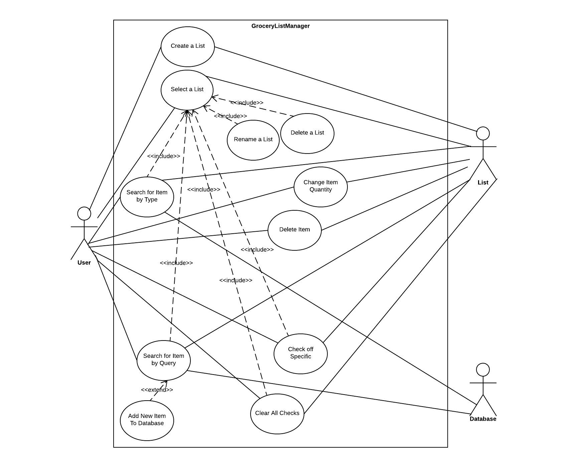

# Use Case Model 

**Author**: Jessica Thomas

## 1 Use Case Diagram

## 2 Use Case Descriptions

1. ### **Create a List**
	**Description:** The use case must allow the user to produce a new, blank list. The list must be modifiable  
and remembered as well. Upon creation, the list must be given a name.

	**Preconditions:** Before the use case is run, there must be enough space to store the produced list.
	
	**Postconditions:** Once the use case is run, the newly produced list must not have the same name as any  
currently stored list, but it will be blank and available to modify. 

	**Basic Course of Action:**
		
		1. The user clicks the "CREATE LIST" icon on the main screen.
		
		2. The system prompts the user for a name for the list. 
		
		3. The user enters a name for the new list. 
		
		4. The name is checked against the list of stored names in the database to verify it has not been used 
		   [Alternate Course: Name Already In Use]
		
		5. A new list is created in the database that the user can modify. 
		
		6. The use case ends. 
		
	**Alternate Course A: Name Already In Use**
	
		1. The system informs the user that the name entered is in use. 
		   [Return to Step 2 in Basic Course of Action]
		   
		
2. ### **Select a List**
	**Description:** The user can pick a list to modify with this use case.
	
	**Preconditions:** There must be at least one list in existence for the user to select before this use  
case is run. 

	**Postconditions:** The user is taken to a screen that contains any items currently on the list, their quantities and checkmarks, as well as options to modify the list.  
	
	**Basic Course of Action:**
	
		1. The user clicks on an available list on the main page. 
		
		2. The system displays a screen that contains the content of the list and options to modify it. 
		
		3. The use case ends. 
	

3. ### **Rename a List**
	**Description:** The user must be able to create a new name for a currently existing list. 
	
	**Preconditions:** Before the case is run, there must be at least one list in existence. In addition, the  
list to be modified must be the currently selected list. 

	**Postconditions:** After the use case is run, the newly named list must not share a name with any list  
currently in existence. 

	**Basic Course of Action:**
	
		1. The user first selects a list. [Use Case 2]
		
		2. The user selects the option to rename the list. 
		
		3. The system prompts the user to enter a new name for the list. 
		
		4. The user enters a new name for the list. 
		
		5. The name is checked against the list of stored names to verify it has not been used 
		   [Alternate Course: Name Already In Use]
		
		6. The system returns the user to the selected list with the name of the list updated. 
		
		7. The use case ends. 
		
	**Alternate Course: Name Already In Use**
	
		1. The system informs the user that the name entered is in use. 
		   [Return to Step 3 in Basic Course of Action]

4. ### **Delete a List**
	**Description:** The user must be able to delete a currently existing list. 
	
	**Preconditions:** Before the case is run, there must be at least one list in existence. In addition, the  
list to be deleted must be the currently selected list. 

	**Postconditions:** The deleted list must no longer be available to select on the main screen. 
	
	**Basic Course of Action:**
	
		1. The user must first select a list. [Use Case 2]
		
		2. The user must select the option to delete the list. 
		
		3. The list is erased from the database. 
		
		4. The user is taken to the main screen. 
		
		5. The use case ends. 

5. ### **Search for Item by Type**
	**Description:** The user must be able to specify the type of the item to then select the name of an  
item to add it to the list currently in modification. 

	**Preconditions:** Before the use case is run, there must be at least one type and name associated with  
that name in the database for the user to choose from. 

	**Postconditions:** The selected list is updated with the new item. The quantity and checkmark of this item can be adjusted afterwards if the user chooses to do so [Use Case 6 and Use Case 8 respectively]. 

	**Basic Course of Action:** 
	
		1. The user selects a list. [Use Case 2]
		
		2. The user clicks the "ADD" button. 
		
		3. The system displays a list of types to the user. 
		
		4. The user selects a type. 
		
		5. The system displays a list of items associated with that type. 
		
		6. The user selects an item name. 
		
		7. The item is added to the list. 
		
		8. The user is taken to the display of the selected list. 
		
		9. The use case ends. 
		

6. ### **Change Item Quantity**
	**Description:** This use case must allow the user to change the item quantity specified. 
	
	**Preconditions:** There must be an item currently specified in order to invoke this use case. 
	
	**Postconditions:** After the use case is run, the item specified must have its updated quantity recorded  
in memory. 

	**Basic Course of Action:** 
	
		
		1. The user highlights the currently entered quantity. 
		
		2. The user specifies a new quantity. 
		
		3. The new quantity for the item on the selected list is saved. 
		
		4. The use case ends. 
		

7. ### **Search for Item by Query**
	**Description:** This use case must allow the user see if an item is currently in the database and add it to the list if is present or invoke add to database if it is not [Use Case 10]. 
	
	**Preconditions:** An list must be selected to modify.
	
	**Postconditions:** After the use case is run, the database must be updated to include new items, if any were created. 
	
	**Basic Course of Action:**
	
		1. The user selects a list [Use Case 2]. 
		
		2. The user selects "SEARCH" on the main screen. 
		
		3. The system displays a screen containing a search bar and a list of items currently in the database. 
		
		3. The user enters input into the search bar. 
		
		4. If the matching or similar item name appears, the user clicks that item and the system verifies this 
		   is the item the user would like to add. [Alternate Course: Item Does Not Exist]
		
		5. The system displays the screen containing the selected list's contents. 
		
		6. The use case ends. 
	
	**Alternate Course: Item Does Not Exist**
	
		1. The user invokes the add new item to the database option. [Use Case 11]
		
		2. The new item is added to the database and the user can select it when adding to the list either 
		   by type or by quer
		
		3. The use case ends
		

8. ### **Delete Item**
	**Description:** This use case should allow the user to remove an item from a list currently being  
modified. 
	
	**Preconditions:** There must be at least one item present on the list in order for this use case to be invoked. 
	
	**Preconditions:** The item must be erased from the list, but can be added again later to the list  

	**Basic Course of Action:** 
	
		1. The user selects a list [Use Case 2]
		
		2. The user clicks the "DELETE ITEM" button next to the item to be deleted. 
		
		3. The system returns to the contents of the selected list; the deleted item is no longer 
		   present on the list. 
		
		4. The use case ends. 		

9. ### **Add New Item to Database**
	**Description:** This use case is used in conjunction with searching for an item by query [Use Case 7] and allows the user to add items into the database. 
	
	**Preconditions:** The use case "Search for Item by Query" must have been called first. 

	**Postconditions:** After the use case is run, the database must be updated to include the newly created  
item. The user should be able to search for this item by name and add it by type. 

	**Basic Course of Action:**
	
		1. The user searches for an item by name [Use Case 7] and invokes add to database if the item 
		   they desire does not exist. 
		
		2. The system prompts the user for an item type and item name. 
		
		3. The user inputs an item type and name. [Alternate Course: User Cancels Add New Item to Database*]
		
		4. The user verifies that this is what they would like to add to the system. 
		
		5. The system saves the new item type and its corresponding item name into the database. 
		
		6. The system returns to the selected list's content screen. 
		
		7. The use case ends. 
	
	**Alternate Course: User Cancels Add New Item to Database**
	
		1. The system returns to the contents of the selected list. 
		
		2. The use case ends. 

10. ### **Check Off Specific**

	**Description:** This use case allows the user to check off a specific item in a list. 
	
	**Preconditions:** There must be at least one item on the list in order for this use case to be invoked. 
	
	**Postconditions:** After this use case is run, the item on the list should be updated to indicate that it  
is checked off. 

	**Basic Course of Action:** 
	
		1. The user must first select a list. [Use Case 2]
		
		2. The user must then click the checkmark option next to the item they want to modify. 
		
		3. The system updates the mark accordingly. 
		
		4. The use case ends. 

11. ### **Clear Checks**

	**Description:** This use case must allow the user to clear all checks from a currently specified list. 
	
	**Preconditions:** There must be at least one item on the list to be modified. 
	
	**Postconditons:** The list should be updated to display that no item is checked off.
	
	**Basic Course of Action:** 
	
		1. The user must first select a list. [Use Case 2]
		
		2. The user must then indicate that they would like to clear all checks.   
		
		3. The system updates the mark accordingly. 
		
		4. The use case ends. 
