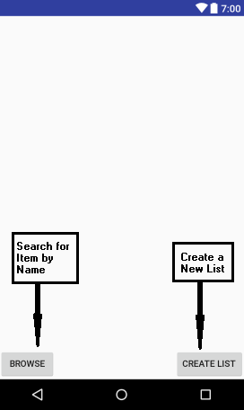

# **Grocery List Manager (GLM)**
## Overview

GLM, or Grocery List Manager for Android helps users create numerous, modifiable grocery lists for efficient shopping. 

## Configurations 

Grocery List Manager operates on devices using the Android operating system. It is compatible with Android 5.0 (Lollipop) API level 21 and higher. 

## User Access Levels
The application is specific for each user that installs the application, as the database for each user is tailored for and modified by the user. 

## Introduction to GLM 
### Initial Page

When the app is first run, this screen will appear. As new lists are created, they will appear on this page of the application. 

When "Browse" is pressed, users are given the chance to search the database for a partular item and if it does not exist, are allowed to add a new item with its type. When "Create" is pressed, the user is prompted to initialize a new list. 

### Browsing the Database

Upon hitting "Browse", the user is taken to a new screen where a list of all items currently in the database are viewable, along with a search bar. Upon hitting the search bar, the user can begin to search for an item. As the user inputs into the search bar, the list becomes tailored to what is typed. When the desired item is found, the user can click on the item and add it to a list. 

However, if the item is not found, the user is given the option "Add to DB", which will add the item to the database. Upon hitting this button, the user can enter the type and then the item name. Upon hitting "Ok", the item is added to the database. The user can then search for the item once more, and then add it to the list as described above. 

### Create a List

When "Create" is selected, the user is prompted to enter a name for the list. Once the list name is created and the user hits "Ok", the newly created list will appear on the initial page as a list to modify. 

### Selecting a List

If no list has been created, the top of the field remains blank, as shown in the figure above. However if lists have been created,  the user is given the option to select a list from the main page. 

### Modifying a List

Once a list is selected, all the items currently on the list are displayed to the user. 

 

