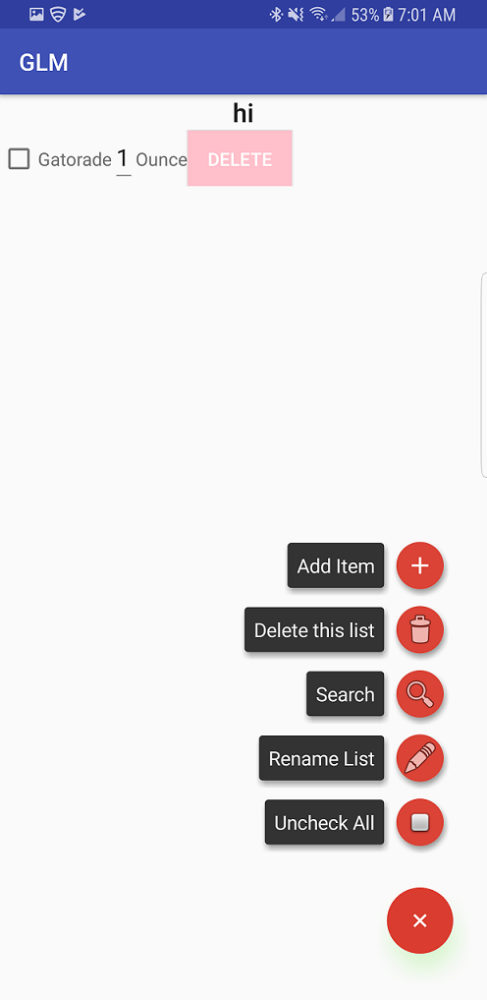
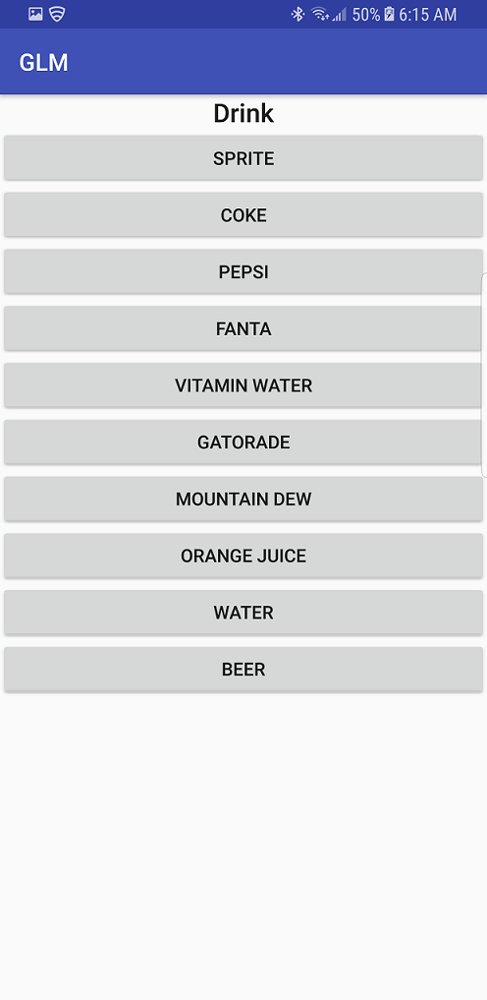
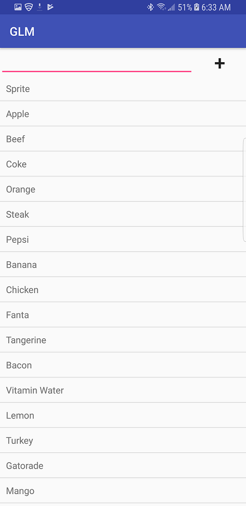

# **Grocery List Manager (GLM)**
## Overview

GLM, or Grocery List Manager for Android helps users create numerous, modifiable grocery lists for efficient shopping. 

## Configurations 

Grocery List Manager operates on devices using the Android operating system. It is compatible with Android 5.0 (Lollipop) API level 21 and higher. 

## User Access Levels
The application is specific for each user that installs the application, as the database for each user is tailored for and modified by the user. 

## Introduction to GLM 
### Initial Page

When the app is first run, this screen will appear. As new lists are created, they will appear on this page of the application. 

When the button featuring a plus sign ("+") is pressed, the user is prompted to initialize a new list. 

### Create a List

When the plus sign is pressed, the user is prompted to enter a name for the list. Once the list name is created and the user hits "Ok", the newly created list will appear on the initial page as a list to modify. 

### Selecting a List

If no list has been created, the top of the field remains blank, as shown in the figure above. However if lists have been created,  the user can select a list from the main screen by simply clicking on its name. The user is taken to a screen which features the contents of that list. 

### List Contents

The list initially will feature no items on it; however, as items are added to the list, the user will see a screen similar to the one above. On this screen, there are two options with regard to items already added to the list. The user can either mark that they have been brought using a checkmark by clicking the box to the left of the item name, or the user can delete a particular item from the list by pressing the "DELETE" button to the right of it. 

The list can be modified by pressing the "+" on the lower right-hand side to produce a menu. On this menu, the user is given various options that can be accessed by pressing the "+" symbol to the right of the option. 

The user can add an item by specifying the type and then the object of the item by pressing "Add Item". 

The user can delete the selected list using the option "Delete this list". 

"Search" allows the user to add an item by searching its name. If the item is not there, the user can add a new item to the database. 

The user can rename the selected list using the option "Rename List"

"Uncheck All" removes all the checkmarks placed next to the items in a selected list. 

### Add Item

The option "Add Item" takes the user to a new screen. On this screen, they are given a list containing the various types of groceries to pick from. 

Say the user selects "Drink"; he or she is taken to a new page where various types of drinks are available to choose from. 

The user can select an item from this list and it will appear on the list they are currently modifying; from here, the user can change the quantity, place a checkmark, or delete the item as necessary. 

### Delete this list

When the user selects the "Delete this list" option, the list is deleted from the population of stored lists. The user is then taken back to the home screen. 

### Search 

Upon hitting "Search", the user is taken to a new screen where a list of all items currently in the database are viewable, along with a search bar. Upon hitting the search bar, the user can begin to search for an item. As the user inputs into the search bar, the list becomes tailored to what is typed. When the desired item is found, the user can click on the item and add it to a list. 

However, if the item is not found, the user is given the option to add to the database. Upon hitting this button, the user can select the type and then type in the item name. After confirming, the item is added to the database. 

### Rename List

Selecting the "Rename List" icon lets the user input a new name for the selected list; as long as the list name is not currently in use, the list shall be renamed according to the user's input. 

### Uncheck All

The "Uncheck All" icon allows the user to have all checkmarks currently in the selected list to be cleared. Hitting this putton removes all checkmarks from the list. 
